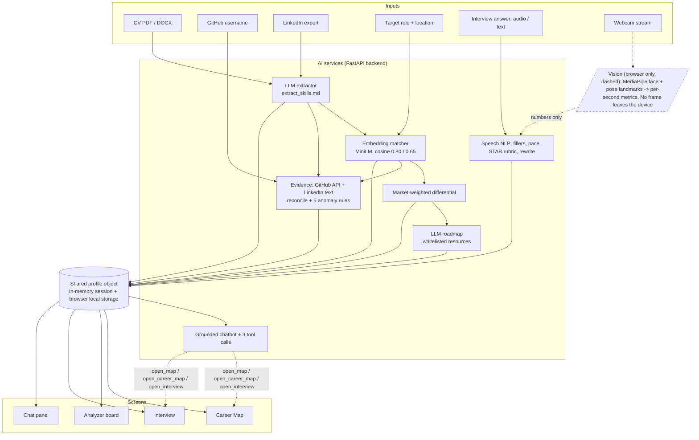

# CareerLens

**Upload your CV, and in two minutes know exactly what to fix, where to apply, and how to answer.**

AICON'26 "Build With AI" entry, EdTech & Workforce domain. One web app, four modules, one shared profile.

## The problem

Students and early-career job seekers in Pakistan lose opportunities for reasons that have nothing to do with
ability: they do not know which of their skills a target role actually wants, their CVs claim things their public
profiles do not back up, they cannot see which nearby employers are hiring for their profile, and they fail
interviews on structure rather than knowledge. Each is a small information gap; together they make the job search
slow, unfocused and demoralising.

| Stage | CareerLens |
|---|---|
| **Problem** | Job seekers cannot see the gap between what they have and what a role needs, and cannot practise closing it |
| **Data / Input** | The user's CV (PDF/DOCX), their own GitHub profile and LinkedIn export, a target job title, geocoded job listings, spoken or typed interview answers |
| **AI Component** | LLM entity extraction, vector-embedding skill matching against roles and jobs, NLP speech analysis (STAR, fillers, pace), computer-vision body-language analysis (face and pose landmarks), profile-grounded chatbot with tool calls |
| **Solution / Output** | One dashboard: Career Map (match %, nearby hiring map with per-job gaps, market-weighted 4-week roadmap), CV anomaly report with integrity score, on-camera mock interviewer with a verbal + body-language readiness score |
| **Impact** | Fewer wasted applications, shorter time-to-first-offer, measurable improvement in interview readiness between sessions |

## The four modules

| Module | What the user gets | Core AI technique |
|---|---|---|
| **Career Map** (skill gap + job finder + roadmap) | "You match 65 % of Data Analyst", a map of nearby companies hiring for it, the skills missing for each job, a 4-week roadmap built from the local market's gaps | Embedding similarity (CV skills vs role and job skill vectors), geocoded job matching, LLM roadmap generation |
| **CV Analyzer** | Claims on the CV not supported by LinkedIn/GitHub (and strengths the CV misses), with a fix for each; integrity score | LLM extraction + cross-source reconciliation + five deterministic anomaly rules |
| **Mock Interviewer** (voice + video) | 3 role-specific questions on camera; live verbal metrics (fillers, STAR, pace) and body-language metrics (eye contact, posture, fidgeting); readiness score; rewritten model answer | Speech-to-text + LLM rubric scoring + MediaPipe landmarks in the browser |
| **Career Chatbot** | Answers grounded in the user's own profile, gaps, jobs and interview results; can open the other screens | Context injection + three tool calls into the other modules |

## Architecture

Every input is turned into structured data once, written to one shared profile object, and every screen reads from
it. Two reused services (the LLM extractor and the embedding matcher) make four modules buildable in two days.
Computer vision runs in the browser and only sends per-second numbers to the backend. Details and data flow per
module: [`docs/architecture.md`](docs/architecture.md).



Stack: React + Vite + Tailwind + Recharts + Leaflet/OpenStreetMap (frontend, Vercel); Python FastAPI, single
service, in-memory session (backend, Render via Docker); one LLM provider (Claude by default, OpenAI or Ollama)
behind `backend/llm_adapter.py` with JSON-schema output for every extraction; `sentence-transformers/all-MiniLM-L6-v2`
locally for embeddings (or `text-embedding-3-small`); Web Speech API + Whisper for speech; `pdfplumber`,
`python-docx`, GitHub REST API via `requests`.

## Repo map

```
README.md, DISCLOSURES.md, ACKNOWLEDGEMENTS.md, LICENSE, .env.example, render.yaml, ruff.toml
.github/workflows/ci.yml        ruff + pytest (+ vitest when frontend/package.json exists) on every push / PR
docs/                           architecture.md, api.md, data_formats.md, prompts.md, demo_script.md, vision_metrics.md (M4)
data/                           roles.json, jobs.json, resources.json, skill_aliases.json  (M5, committed and disclosed)
scripts/                        build_roles.py, build_jobs.py, geocode.py, make_demo_files.py, build_demo_cache.py
demo/                           demo_cv.pdf, linkedin_export.pdf, github_username.txt, cached_responses.json, README.md
backend/
  main.py                       FastAPI app, CORS, routers, /health, /built-with
  llm_adapter.py                complete_json(), chat(), embed(); provider switch + local fallback
  built_with.py                 source of truth for ACKNOWLEDGEMENTS.md and GET /built-with
  schemas/                      Pydantic contracts (profile, skill, job, interview, role, api); generates frontend/src/types/profile.ts
  prompts/                      one readable .md per prompt (see docs/prompts.md)
  services/                     extractor, normalize, matcher, differential, roadmap, career, chat, geo, data, session, cv_text
  services/evidence/            github.py, linkedin.py, reconcile.py, anomalies.py
  services/interview/           fillers, pace, star, questions, rewrite, transcribe, scoring, nonverbal
  api/                          profile, career, chat, jobs, analyzer, interview (one router per module)
  tests/                        pytest; no network, no LLM calls
  Dockerfile, requirements*.txt
frontend/                       Vite + React + TypeScript + Tailwind (src/pages, components, store, hooks, vision/, types/)
```

## Setup

Backend (Python 3.11+):

```bash
python -m venv .venv
.venv/Scripts/activate                 # Windows;  macOS/Linux: source .venv/bin/activate
pip install -r backend/requirements.txt
cp .env.example .env                   # free: LLM_PROVIDER=groq + GROQ_API_KEY (or Anthropic / OpenAI / Ollama); see "Environment variables"
uvicorn backend.main:app --reload      # http://localhost:8000  (interactive docs at /docs)
```

Frontend:

```bash
cd frontend
npm i
npm run dev                            # http://localhost:5173
```

Tests and lint (CI runs the same): `pip install -r backend/requirements-dev.txt`, then
`pytest backend/tests -q` and `ruff check backend scripts`. Docker: `docker build -f backend/Dockerfile -t careerlens-api .`
from the repo root (the image bakes in the MiniLM model so a cold start is fast).

### Environment variables

All optional; `.env.example` documents each one. The backend loads `<repo root>/.env` on startup (blank values keep the defaults; variables already set in the shell win). The important ones:

| Variable | Default | Meaning |
|---|---|---|
| `LLM_PROVIDER` | `anthropic` | `anthropic`, `openai`, `groq`, `deepseek`, `grok` or `ollama` (local fallback) |
| `GROQ_API_KEY` / `DEEPSEEK_API_KEY` / `XAI_API_KEY` | | Keys for the `groq` (free tier, also used for Whisper transcription), `deepseek` and `grok` shortcuts; models via `GROQ_MODEL` / `DEEPSEEK_MODEL` / `XAI_MODEL` |
| `ANTHROPIC_API_KEY` / `OPENAI_API_KEY` | | Provider key |
| `OPENAI_BASE_URL` | OpenAI | Any OpenAI-compatible host, e.g. Groq `https://api.groq.com/openai/v1` with `LLM_PROVIDER=openai` and `OPENAI_MODEL=openai/gpt-oss-120b` |
| `ANTHROPIC_MODEL` / `OPENAI_MODEL` / `OLLAMA_MODEL` | `claude-sonnet-5-5` / `gpt-4o-mini` / `llama3.2` | Model ids |
| `OPENAI_FALLBACK_MODEL` / `OPENAI_REASONING_EFFORT` | `openai/gpt-oss-20b` for gpt-oss-120b / `low` for gpt-oss | Second model tried on a 429 rate limit; reasoning budget for reasoning models |
| `EMBED_PROVIDER` / `EMBED_MODEL` | `local` / `sentence-transformers/all-MiniLM-L6-v2` | Embeddings; `openai` uses `OPENAI_EMBED_MODEL` |
| `GITHUB_TOKEN` | | Optional; 5000 req/h instead of 60 |
| `LLM_CACHE_PATH`, `LLM_CACHE_RECORD`, `GITHUB_CACHE_PATH` | | Offline replay of the demo (see `demo/README.md`) |
| `ROLES_PATH`, `JOBS_PATH`, `RESOURCES_PATH`, `SKILL_ALIASES_PATH` | `data/*.json` | Dataset overrides |
| `CORS_ORIGINS` | `http://localhost:5173,http://127.0.0.1:5173` | Browser origins allowed to call the API |

## Try it as a judge

Follow [`demo/README.md`](demo/README.md): start the backend, upload `demo/demo_cv.pdf`, pick **Data Analyst**,
and expect the match %, 20+ pins near Karachi, a roadmap, and exactly three anomalies in the Analyzer (Kubernetes
unsupported, JavaScript missed, "Expert in Docker" overclaim). The same file explains offline mode
(`LLM_CACHE_PATH=demo/cached_responses.json`) and how to swap in a real GitHub username.

## API

One row per endpoint, with owner, request and response, in [`docs/api.md`](docs/api.md). Summary:

| Route | Purpose |
|---|---|
| `POST /profile/cv`, `GET /profile`, `PATCH /profile`, `DELETE /profile` | Upload the CV; read, adjust and delete the session profile |
| `GET /career/gap`, `/career/roadmap`, `/career/adjacent` | Role match + market gaps + nearby jobs; 4-week roadmap (pin a job); adjacent roles |
| `GET /jobs/nearby`, `GET /jobs/{job_id}` | Geocoded jobs within a radius, each scored against the user's skills |
| `POST /analyzer/run`, `GET /analyzer/report` | CV vs GitHub vs LinkedIn anomaly report and integrity score |
| `POST /interview/start`, `/interview/answer`, `GET /interview/report` | 3 questions, per-answer scoring, readiness report |
| `POST /chat` | Server-sent events; may emit `open_map`, `open_career_map`, `open_interview` |
| `GET /health`, `GET /built-with` | Liveness + provider/data status; every component with its licence |

Prompts are plain `.md` files in `backend/prompts/`, indexed in [`docs/prompts.md`](docs/prompts.md).

## Data and privacy

- **Only the user's own data, only with their action.** They upload their own CV and enter their own GitHub
  username or LinkedIn export. Nothing is fetched about anyone else.
- **PII is stripped before any LLM call**: the CV parser (`backend/services/extractor.py`) redacts email, phone and
  ID numbers, date-of-birth and address lines. Only skills, projects and experience are extracted; no name, gender,
  age, university or photo reaches the matcher.
- **Video never leaves the browser.** MediaPipe runs on the device; frames are discarded one by one and only
  per-second geometric metrics (head angle, shoulder tilt, wrist velocity, blendshape averages) are posted. No face
  data is stored and no emotion or identity inference is made; the UI shows a one-line fairness note.
- **No accounts, no database.** The profile lives in browser local storage plus an in-memory server session; the
  **Delete my data** button (`DELETE /profile`) clears both.
- **LinkedIn is never scraped** (its terms prohibit it); the user's own "Download your data" export or pasted
  profile text is used instead.
- **GitHub via the official REST API**, within rate limits (60 req/h unauthenticated, 5000 with a token), the
  user's own username only.
- **Datasets are synthetic or public and labelled**: roles from ESCO / O*NET, jobs from public postings with source
  URLs or marked `synthetic: true`, the demo persona is fictional. Everything prepared before the event is dated in
  [`DISCLOSURES.md`](DISCLOSURES.md); every model, API, dataset and library with its licence is in
  [`ACKNOWLEDGEMENTS.md`](ACKNOWLEDGEMENTS.md) and served by `GET /built-with`.

## Metrics, thresholds and weights (kept here so judges can check them)

| Metric | Rule |
|---|---|
| Skill match | Cosine between MiniLM embeddings of skill names: **>= 0.80 matched**, **0.65-0.80 partial** (shown, no credit), below missing. Match % = weighted matched / weighted total; exact name matches skip the model |
| Market gap priority | `role_weight * (0.5 + 0.5 * share of the 20 nearest jobs requiring the skill)` |
| Job ranking | Blend of match % and distance, default 70/30 (slider); pins green >= 75 %, amber 50-74 %, red < 50 % |
| Anomaly rules | Unsupported claim (CV skill in no repo language/topic and absent from LinkedIn); missed strength (language > 20 % of GitHub code, absent from CV); weak evidence (CV project with same-name repo of 0-1 commits or empty README); inconsistency (job title / dates differ CV vs LinkedIn); overclaim ("Expert"/"Advanced" for a skill with a single mention). Integrity = share of CV claims with at least one external source |
| Filler words | Regex count of um / uh / like / you know / basically / actually / so, **per 100 words**; pure code, no LLM |
| Conciseness and pace | Behavioural answer target **90-180 s, 150-300 words**; pace band **120-160 words per minute** |
| STAR | LLM with a strict JSON schema: each of Situation / Task / Action / Result has `present` and a quoted `evidence_span`; an empty span means not present (no hallucinated Result) |
| Verbal score | `0.40 * STAR + 0.20 * conciseness + 0.15 * (100 - filler_penalty) + 0.15 * relevance + 0.10 * pace`; relevance is the embedding cosine between answer and question |
| Body-language score | Eye contact **35 %**, posture **25 %**, fidgeting **20 %**, head stability **10 %**, expression **10 %**. Eye contact = share of frames with head yaw and pitch within +/-15 degrees of the camera; all formulas in `docs/vision_metrics.md` |
| Readiness | **`0.70 * verbal + 0.30 * non_verbal`** (stated in the UI; equals verbal in text-only mode) |

## Team

| Member | Role | Owns |
|---|---|---|
| M1 | AI core / backend lead | `backend/llm_adapter.py`, `backend/schemas/`, `backend/prompts/{extract_skills,roadmap,chat_system}.md`, `backend/services/{extractor,normalize,matcher,differential,roadmap,career,chat,geo,data,session,cv_text}.py`, `backend/api/{profile,career,chat,errors}.py`, `frontend/src/types/profile.ts`, their tests |
| M2 | Frontend lead | `frontend/` scaffold, store, shell, Upload, Dashboard, Career Map (gap panel, map, roadmap), chat panel, Analyzer board, `vercel.json` |
| M3 | Interview NLP | `backend/services/interview/{fillers,pace,star,questions,rewrite,transcribe,scoring}.py`, `backend/prompts/{star_rubric,question_gen,rewrite_star}.md`, `backend/api/interview.py`, `frontend/src/pages/Interview.tsx` and its components, `useSpeechRecognition`, `useAudioRecorder`, `lib/{interviewApi,fillers,starCues}.ts` |
| M4 | Computer vision | `frontend/src/vision/*`, `WebcamPanel.tsx`, `NonVerbalGauges.tsx`, `useVisionMetrics.ts`, `frontend/src/dev/` (the `/vision` calibration page), `frontend/public/models/`, `backend/services/interview/nonverbal.py`, `backend/prompts/coaching_notes.md`, `docs/vision_metrics.md` |
| M5 | Data, evidence & DevOps (main contact) | `data/*.json`, `scripts/`, `backend/services/evidence/*`, `backend/prompts/anomaly_fix.md`, `backend/api/{jobs,analyzer}.py`, `backend/main.py`, `backend/built_with.py`, `backend/Dockerfile`, `requirements*.txt`, `render.yaml`, `.github/workflows/ci.yml`, `demo/`, `README.md`, `DISCLOSURES.md`, `ACKNOWLEDGEMENTS.md`, `docs/{architecture,demo_script}.md`, `LICENSE` |

Branches are `feat/<member>-<feature>`; PRs are reviewed by the backup member and must pass CI; commits use
conventional prefixes (`feat:`, `fix:`, `data:`, `docs:`).

## SDG alignment

- **SDG 4.4** - more youth with relevant skills for employment: the gap analysis and the free roadmap.
- **SDG 8.6** - fewer youth not in employment, education or training: the map and the matching.
- **SDG 10.2** - inclusion regardless of economic status: free, no login, runs on a low-end laptop; skills-only
  matching with no name, gender or university in the model input.

Next step after the hackathon: pilot with one university placement office for its final-year cohort, measuring
placement time against the previous year.

## Licence

MIT, 2026, CareerLens team. See [`LICENSE`](LICENSE) and [`ACKNOWLEDGEMENTS.md`](ACKNOWLEDGEMENTS.md) for third-party licences.
