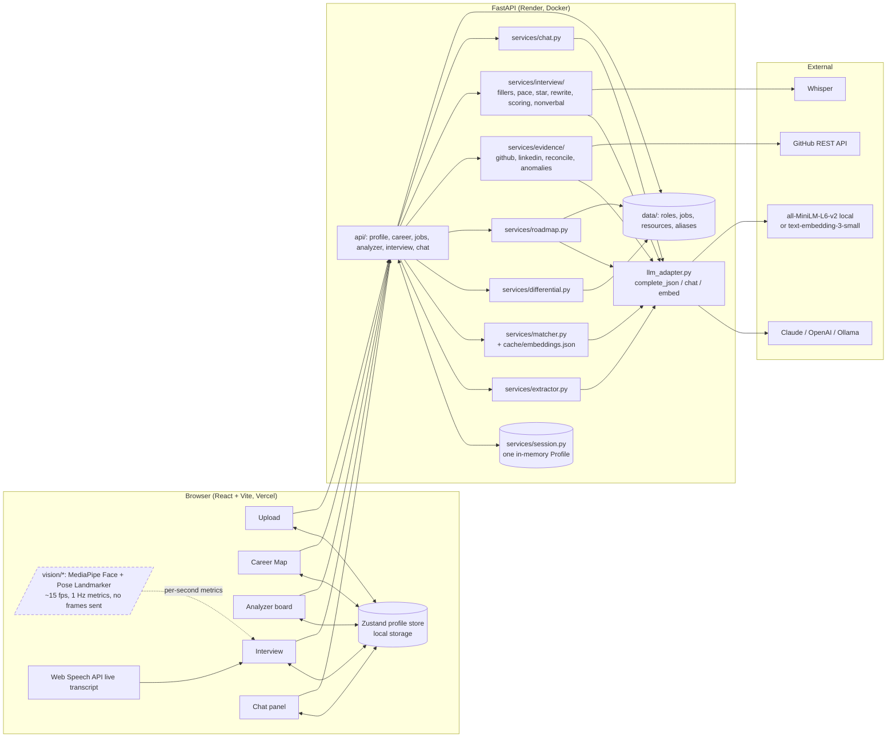

# Architecture

CareerLens is one React front end and one FastAPI service. Every input is turned into structured data once, written
to a single shared **profile object**, and every screen reads from it. Two services are reused by every module (the
LLM extractor and the embedding matcher); computer vision runs entirely in the browser and sends only numbers.

## Component diagram

## The shared profile object

`backend/schemas/profile.py` (`Profile`) is the contract every module writes to and reads from; the TypeScript
mirror `frontend/src/types/profile.ts` is generated from it. Fields and their producers:

| Field | Producer | Consumers |
|---|---|---|
| `skills`, `projects`, `experience` | M1 extractor (`POST /profile/cv`) | everything |
| `target_role`, `location`, `mode` | the user (upload form, `PATCH /profile`) | career, jobs, interview, chat |
| `gap`, `market_gaps`, `jobs_nearby` | `GET /career/gap` (and the upload when a role is given) | Career Map, chat, roadmap |
| `roadmap` | `GET /career/roadmap` | Career Map, chat |
| `anomalies`, `integrity_score` | `POST /analyzer/run` | Analyzer board, dashboard, chat |
| `interview` | `POST /interview/answer` / `GET /interview/report` | Interview report, dashboard, chat |

There are no accounts. The server keeps one `Profile` in memory (`services/session.py`, guarded by a lock, deep
copies in and out); the browser keeps its own copy in local storage. `DELETE /profile` ("Delete my data") resets the
server copy and the UI clears local storage.

## The two reused services

**LLM extractor** (`services/extractor.py`, prompt `prompts/extract_skills.md`). Text in, `ExtractedCV` out
(skills with quoted evidence, projects, experience). Before the call it redacts email, phone / ID numbers,
date-of-birth and address lines; after the call it drops any skill whose evidence quote or name does not occur in
the text, and normalises names through `services/normalize.py` (`data/skill_aliases.json`). Used by the CV upload,
the LinkedIn export parser, and at build time by `scripts/build_jobs.py` to pre-extract `required_skills` for
every listing.

**Embedding matcher** (`services/matcher.py`). `match(user_skills, target_skills)` embeds skill names with
`llm_adapter.embed()` (unit vectors, so cosine is a dot product) and classifies each target skill: cosine
>= 0.80 matched, 0.65-0.80 partial, below missing; match % is weighted matched over weighted total. Exact name
matches skip the model. Every vector is cached in memory and in `backend/cache/embeddings.json`, so matching
against 20 jobs embeds each skill name once. Used by the role gap, every nearby job, adjacent roles, the market
differential, cross-source reconciliation in the analyzer, and interview relevance.

## Data flow per module

### Career Map (gap + jobs + roadmap)

1. `POST /profile/cv` (file + `target_role`, `lat`/`lng`): `cv_text.extract_text` -> `extractor.extract_from_text`
   -> `Profile.skills/projects/experience`; with a role, `career.compute_gap` runs immediately.
2. `career.compute_gap`: `data.find_role` -> `matcher.match(skills, role.skills)` -> `MatchResult`;
   `geo.nearby_jobs` picks the 20 nearest listings within the radius; `differential.score_job` matches the user
   against each job; `differential.market_gaps` ranks the missing role skills by `role_weight * (0.5 + 0.5 * share
   of nearby jobs requiring it)`.
3. `GET /jobs/nearby` returns every job in the radius (not just 20) with its own match, for the map pins;
   `GET /jobs/{id}` gives the full listing for the detail card.
4. `GET /career/roadmap`: `roadmap.build_roadmap` sends the ranked market gaps and the whitelisted resources for
   them to the LLM (`prompts/roadmap.md`); URLs not in `data/resources.json` are rejected, and a deterministic plan
   from the same data is used if the call fails. Pinning a job weights that job's missing skills first.
5. `GET /career/adjacent`: the same matcher against every role, top N.

### CV Analyzer

1. `POST /analyzer/run` (`github_username`, `linkedin_export` file or `linkedin_text`), after a CV is in the
   session.
2. `evidence/github.py`: official REST API (repos, languages per repo, topics, README, commit count); reads
   `GITHUB_CACHE_PATH` first so the demo username works offline; `GITHUB_TOKEN` raises the rate limit.
3. `evidence/linkedin.py`: export PDF/TXT -> text -> the same extractor, skills tagged `linkedin`.
4. `evidence/reconcile.py`: embeds every skill and project across the three sources, clusters by cosine >= 0.80,
   tags each cluster with its set of sources.
5. `evidence/anomalies.py`: the five deterministic rules (unsupported claim, missed strength, weak evidence,
   inconsistency, overclaim) -> `Anomaly[]`; integrity score = share of CV claims with at least one external
   source. `prompts/anomaly_fix.md` adds one sentence on why each matters to a recruiter and one concrete fix, with
   a templated fallback if the LLM fails.
6. Written to `Profile.anomalies` / `integrity_score`; `GET /analyzer/report` returns the latest report.

### Mock Interviewer

1. `POST /interview/start` (`role`): `interview/questions.py` seeds three questions with the user's role and 2-3
   profile skills (`prompts/question_gen.md`).
2. In the browser: Web Speech API gives the live transcript; `vision/landmarker.ts` runs MediaPipe Face + Pose
   Landmarker on the webcam at ~15 fps, `vision/metrics.ts` and `aggregate.ts` turn landmarks into one
   `NonVerbalSample` per second (head yaw/pitch, nose position, shoulder tilt, lean, wrist velocity, smile/brow,
   nods). No frame is ever uploaded.
3. `POST /interview/answer` (audio or transcript + samples): `transcribe.py` (Whisper) for the final transcript;
   `fillers.py` and `pace.py` (pure code); `star.py` (`prompts/star_rubric.md`, evidence spans must quote the
   transcript); `rewrite.py` (`prompts/rewrite_star.md`); relevance via the matcher; `nonverbal.py` aggregates the
   samples into eye contact %, posture flags, fidget %, expression label and the weighted body-language score;
   `prompts/coaching_notes.md` writes 2-3 notes.
4. `scoring.py`: `verbal = 0.40 STAR + 0.20 conciseness + 0.15 (100 - filler penalty) + 0.15 relevance + 0.10 pace`;
   `readiness = 0.70 verbal + 0.30 non_verbal`. `GET /interview/report` -> `Profile.interview`.

### Career Chatbot

`POST /chat` streams server-sent events. `services/chat.py` builds the system prompt (`prompts/chat_system.md`)
with a summary of the whole profile (skills, gap, anomalies, roadmap, top jobs, interview scores) on every
message, so no vector database is needed, and exposes three tools: `get_jobs_near_me`, `explain_gap`,
`start_mock_interview`. Tool results become `open_map` / `open_career_map` / `open_interview` events the UI acts
on before the answer text arrives. The mode flag (`student` / `job_seeker`) changes tone and defaults. It refuses
to invent companies or salaries and points to the right module when the data is not there.

## Deployment

- Backend: `backend/Dockerfile` (python:3.11-slim, non-root, MiniLM model pre-downloaded) deployed on Render via
  `render.yaml`; `GET /health` is the health check and reports the active providers and dataset counts.
- Frontend: Vercel (`frontend/vercel.json`, M2), calling the API URL from `VITE_API_URL`.
- CI: `.github/workflows/ci.yml` runs `ruff check backend scripts` and `pytest backend/tests -q` on Python 3.11
  with `backend/requirements-ci.txt` (no torch), and `vitest` when `frontend/package.json` exists.

## Offline fallback path

The demo must survive a dead API key or a flaky venue connection. The path, rehearsed once before the event:

1. **Embeddings**: `EMBED_PROVIDER=local` uses `all-MiniLM-L6-v2` on CPU (baked into the Docker image, cached in
   `~/.cache/huggingface` locally); `backend/cache/embeddings.json` holds every vector already computed.
2. **LLM calls**: `LLM_CACHE_PATH=demo/cached_responses.json` makes `llm_adapter.complete_json()` answer any
   prompt it has recorded (keyed by a SHA-256 of schema + prompt) without a network. The file is produced by running the demo flow
   once with `LLM_CACHE_RECORD=1` (`scripts/build_demo_cache.py`). Prompts not in the cache fall through to the
   configured provider; with `LLM_PROVIDER=ollama` that provider is local too.
3. **GitHub**: `evidence/github.py` checks the cache file first (`GITHUB_CACHE_PATH`, default
   `demo/cached_responses.json`) and serves the demo username's repos, languages, topics and READMEs from it; any
   other username goes to the API.
4. **Jobs and roles**: `data/*.json` are committed; nothing is fetched live. Map tiles for the demo city are
   cached by the browser during rehearsal.
5. **Interview**: text mode is first-class (the presenter can type the rehearsed answer); the filler, pace and
   body-language metrics are pure code; STAR and the rewrite come from the LLM cache for the rehearsed answer.
6. Last resort: the screen recording.
